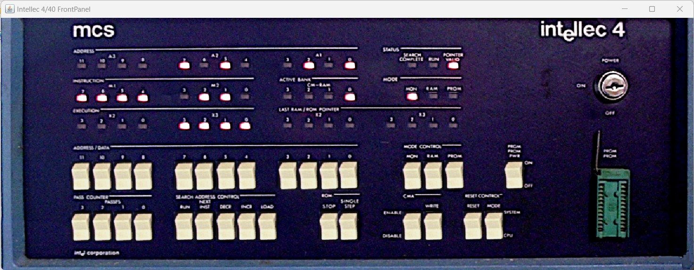

# Intellec 4 Basic Simulation with Monitor ROM

This folder contains a basic simulation of an Intellec 4 system having a Monitor ROM installed.

The Monitor program doesn't seem to work as expected for all the commands. It may be either an error with the ROM used or with the CPU simulation.

A similar simulation can be accessed from the Intellec_4_mod_40 folder. Please use that one instead. However, if you continue to use this simulation and find a reason for it not to work do leave a comment. 

Please look at the [README](../README.md) file in the above folder for useful links with information about the Intellec system and the CPU.
Specific to this simulation:
- ROMs: https://www.retrotechnology.com/restore/4040_robson.lst , https://www.retrotechnology.com/restore/intel440_roms.html
- Intellec 8/Mod 80 Operators Manual (contains information about monitor commands which are similar on Intellec 4): http://www.nj7p.org/Manuals/PDFs/Intel/9800003A.pdf

