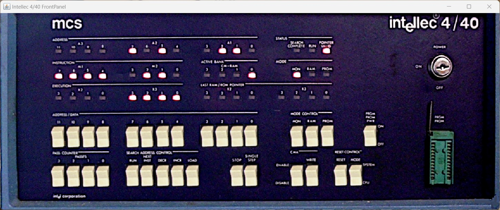
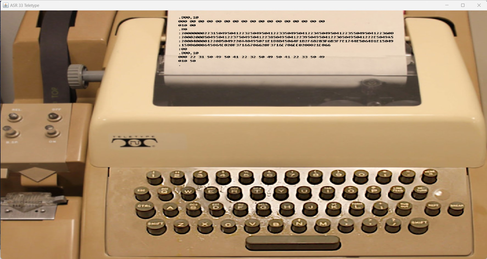

# Intellec 4/40 Basic Simulation with Monitor ROM

This folder contains a basic simulation of an Intellec 4/40 system having a Monitor ROM installed.

Please look at the [README](../README.md) file in the above folder for useful links with information about the Intellec system and the CPU.
Specific to this simulation:
- ROMs: https://www.retrotechnology.com/restore/4040_robson.lst , https://www.retrotechnology.com/restore/intel440_roms.html
- Intellec 8/Mod 80 Operators Manual (contains information about monitor commands which are similar on Intellec 4): http://www.nj7p.org/Manuals/PDFs/Intel/9800003A.pdf

The simulation will open two windows:
- An Intellec 4/40 front panel window. The buttons can be pressed with the mouse.

- An ASR33 Teletype allowing communication with the Intellec system.

The Teletype has a tape loaded mapped to the file "write_tty.hex". 
It can be read using the "R0" command in the Monitor.
The content can be inspected with the "D00,20" command (the range can be increased to see more of the hex file).
Hex format can be produced again using the "W00,20" command. 
BPNF format can be produced using the "B00,10" command.

More Monitor commands can be seen here: https://www.retrotechnology.com/restore/440_mon.txt

Simulation speed can be increased/decreased by changing the simulation.json value "delay_between_steps_ns":130000 .
 
