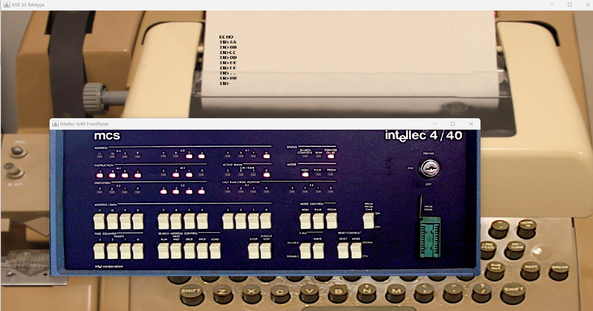

# Intellec 4/40 Simple Echo Test

This folder contains a basic simulation of an Intellec 4/40 system with a custom ROM containing an "echo" test.
It allows entering a character using an ASR33 Teletype and this character will be echoed back to the teletype.
The read and write routines were extracted from the Monitor ROMs available here: https://www.retrotechnology.com/restore/intel440_roms.html .
The complete source code is available in the file [echo_read_write.asm](echo_read_write.asm).
The generated .lst file is also available in the repository. 
Individual files for the read and write routines are also available in the repository with very simple example calls. 

The code was compiled to hex format using the A04 4004 4040 cross-assembler: https://www.retrotechnology.com/restore/a04.html , https://www.retrotechnology.com/restore/a04.zip .
Compilation was done on Windows with the command: 
```
a04.exe -l echo_read_write.lst -o echo_read_write.hex echo_read_write.asm
``` 

The simulation also features the Intellec front panel. It can be used to step through the code and reset the system.

The simulation will open 2 windows:
- The Intellec 4/40 front panel window. The buttons can be pressed with the mouse.
- ASR33 Teletype allows entering characters and seeing them echoed back.



Simulation speed can be increased/decreased by changing the simulation.json value `"delay_between_steps_ns":130000` .
The individual read/write routine demo files can be executed by changing the value associated with the entry `{"key":"load_hex", "value":"echo_read_write.hex"}` in the simulation.json file.
 
Please look at the [README](../README.md) file in the above folder for useful links with information about the Intellec system and the CPU.

