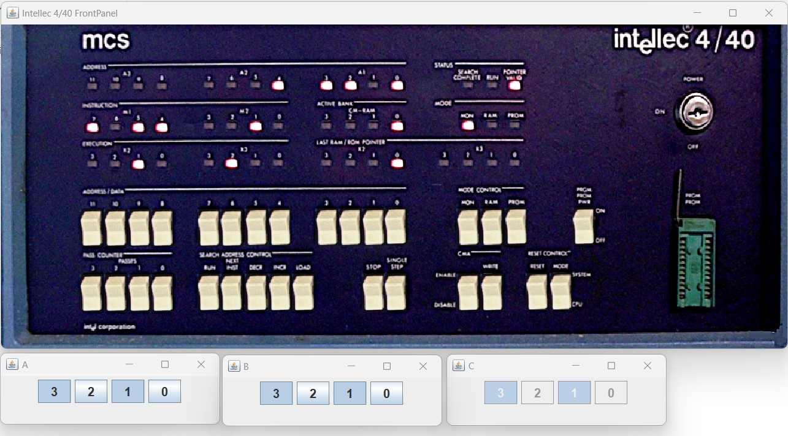

# Intellec 4/40 with attached 2x4 switches and 4 LEDs

This folder contains a basic simulation of an Intellec 4/40 system having attached 8 switches separated in series of 4 and 4 LEDs.
The ROM contains a program that continously reads the switch status and employs the 4-bit AND routine from here: http://bitsavers.informatik.uni-stuttgart.de/components/intel/MCS4/SIM4-02_Hardware_Simulator_Dec72.pdf .
The result is shown on the 4 LEDs.
The complete source code is available in the file [4_bit_and.asm](4_bit_and.asm).
The generated .lst file is also available in the repository.

The code was compiled to hex format using the A04 4004 4040 cross-assembler: https://www.retrotechnology.com/restore/a04.html , https://www.retrotechnology.com/restore/a04.zip .
Compilation was done on Windows with the command: 
```
a04.exe -l 4_bit_and.lst -o 4_bit_and.hex 4_bit_and.asm
``` 

The simulation also features the Intellec front panel. It can be used to step through the code and reset the system.

The simulation will open 4 windows:
- The Intellec 4/40 front panel window. The buttons can be pressed with the mouse.
- 2 windows corresponding to the switch groups. Again the mouse can be used to interract with the buttons. These are just simple Java buttons without any fancy graphics.
- 1 window corresponding to the LEDs. These will light up automatically based on the result of the 4-bit AND routine.



Simulation speed can be increased/decreased by changing the simulation.json value `"delay_between_steps_ns":130000` .
 
