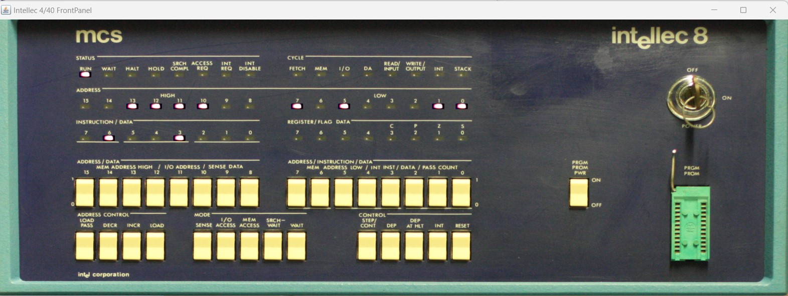
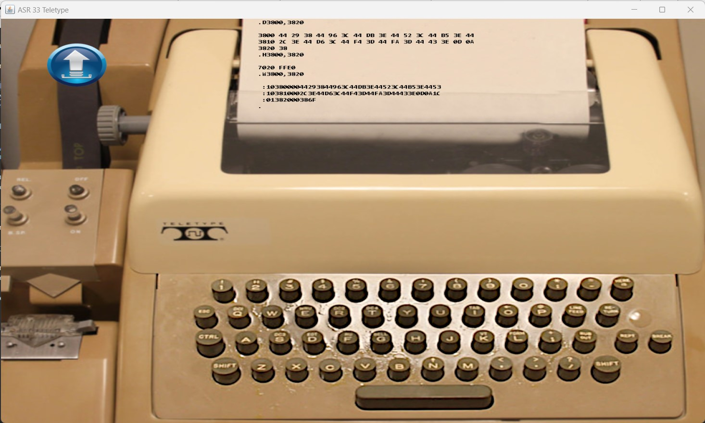

# Intellec 8 Simple Simulation with Monitor ROM

This folder contains a basic simulation of an Intellec 8 system having a Monitor ROM installed.

The system will start in the HALT state. You must enter a JMP in memory location 0 and hit reset.
For convenience there is already a JMP 3800 entered in memory. 
You only need to press the Reset button on the front panel to start the monitor application.

Please look at the [README](../README.md) file in the above folder for useful links with information about the Intellec system and the CPU.
Specific to this simulation:
- Monitor program from: https://mark-ogden.uk/files/intel/publications/98-022B%20intellec%208-MOD%208%20MONITOR%20V3.0-Apr75.pdf
; (Intellec 8/MOD 8 Monitor, version 3.0, 14 april 1975)

The simulation will open two windows:
- An Intellec 8 front panel window. The buttons can be pressed with the mouse.

- An ASR33 Teletype allowing communication with the Intellec system.

The Teletype has a tape loaded mapped to the file "puts_mon.hex". 
It can be read using the "R0" command in the Monitor.

Simulation speed can be increased/decreased by changing the simulation.json value "delay_between_steps_ns":130000 .
 
