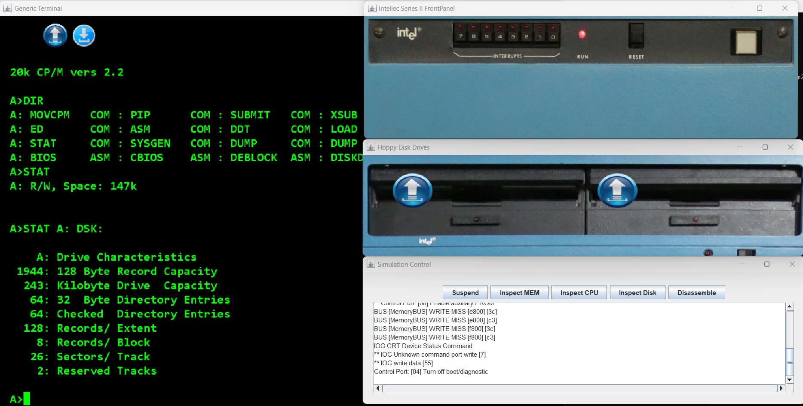

# Intellec 8 MOD 80 Simulation with CP/M 2.2

This folder contains a basic simulation of an Intellec 8 mod 80 system, with an Intel 8080 CPU, having a Monitor ROM installed and booting the CP/M 2.2 operating system from a floppy disk image.

When the simulation starts, it expects you to press "SPACE" in the terminal in order to continue with the monitor and to boot the operating system.
This behaviour is coming from the monitor ROM and is not related to the simulation software.

Currently PIO is not implemented. Corresponding message will be shown during boot.

The simulation will create an overlay image to save disk changes. The original CPM image will remain unchanged. The OVR image can be deleted to revert to the original system disk. 
If you want to export an IMD including the OVR changes, this can be done from the Disk Inspector (from the Simulation Control window).

Please look at the [README](../README.md) file in the above folder for useful links with information about the Intellec 8 MOD 80 system and the CPU.
Specific to this simulation:
- The monitor listing is included in the simulation folder. You can also find the source code here: https://bitsavers.org/components/intel/MCS80/Intel_SDK-80_Monitor_Listing.pdf
- CPM system image from: http://www.gaby.de/maslin/maslin_archives.zip  (other apps are available in here)
- CPM applications (make sure to run only apps for the Intel 8080 CPU): http://dunfield.classiccmp.org//img42841/applic.htm
- ImageDisk software and IMD format: http://dunfield.classiccmp.org/img/  ;  https://oldcomputers-ddns.org/public/pub/manuals/imd.pdf
 

The simulation will open multiple windows:
- An Intellec 8 mod 80 front panel window. (currently the buttons are not working)
- Two floppy disk drives
- A generic terminal window
- The Simulation Control Window

The simulation can be changed to include a specific terminal or an ASR33 Teletype. Please look at the simulations for the Intellec 8 system for examples.
Simulation speed can be increased/decreased by changing the simulation.json value "delay_between_steps_ns":5000 .

