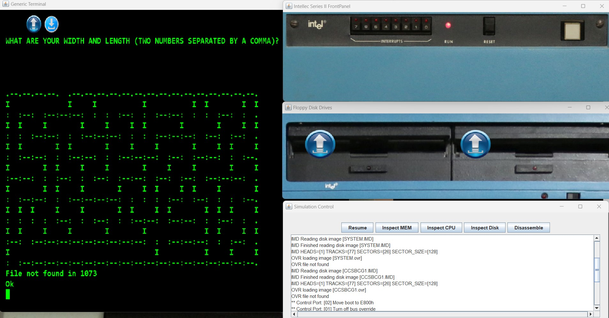
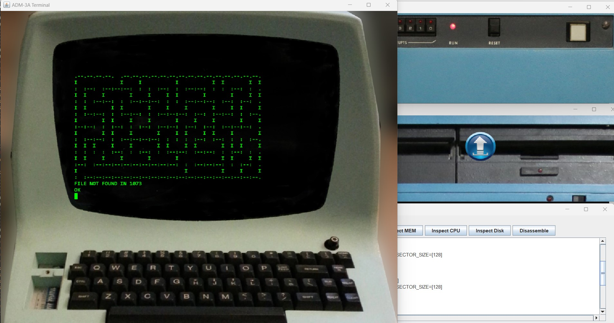

# Intellec 8 MOD 80 Simulation with CP/M 2.2 for playing BASIC games

This folder contains a simulation of an Intellec 8 mod 80 system, with an Intel 8080 CPU, having a Monitor ROM installed and booting the CP/M 2.2 operating system from a floppy disk image.
The system disk contains a minimum CP/M with added MBASIC and Nevada Edit. The second floppy drive is pre-loaded with a disk image containing BASIC games. 

When the simulation starts, it expects you to press "SPACE" in the terminal in order to continue with the monitor and to boot the operating system.
This behaviour is coming from the monitor ROM and is not related to the simulation software.

The simulation starts with two attached terminals: a Generic Terminal (aware of ANSI control codes) and an ADM-3A terminal (aware only of specific control codes and without the lower case characters extension). 

Currently PIO is not implemented. Corresponding message will be shown during boot. The message can be safely ignored.

The simulation will create an overlay image to save disk changes. The original disk images will remain unchanged. The OVR files can be deleted to revert to the original disks. 
If you want to export an IMD including the OVR changes, this can be done from the Disk Inspector (from the Simulation Control window).

Please look at the [README](../README.md) file in the above folder for useful links with information about the Intellec 8 MOD 80 system and the CPU.
Specific to this simulation:
- CPM system image initially from: http://www.gaby.de/maslin/maslin_archives.zip  (other apps are available in here) . This was changed by deleting extra utilities and including MBASIC and Nevada Edit.
- CPM applications (make sure to run only apps for the Intel 8080 CPU): http://dunfield.classiccmp.org//img42841/applic.htm
- BASIC disks: http://dunfield.classiccmp.org/img42841/a/c8ccsbas.zip (there are two disk images, only the first is pre-loaded in the B: drive)
- ImageDisk software and IMD format: http://dunfield.classiccmp.org/img/  ;  https://oldcomputers-ddns.org/public/pub/manuals/imd.pdf
 

The simulation will open multiple windows:
- An Intellec 8 mod 80 front panel window. (currently the buttons are not working)
- Two floppy disk drives
- A generic terminal window
- An ADM-3A terminal window
- The Simulation Control Window

The simulation can be changed to include a specific terminal or an ASR33 Teletype. Please look at the simulations for the Intellec 8 system for examples.
Simulation speed can be increased/decreased by changing the simulation.json value "delay_between_steps_ns".

