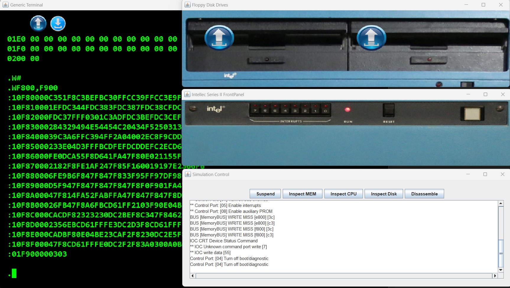

# Intellec 8 MOD 80 Simple Simulation with Monitor ROM

This folder contains a basic simulation of an Intellec 8 mod 80 system, with an Intel 8080 CPU, having a Monitor ROM installed.

When the simulation starts, it expects you to press "SPACE" in the terminal in order to continue with the monitor.
This behaviour is coming from the monitor ROM and is not related to the simulation software.

After starting the monitor, you can access also the Diagnostic ROM by typing the monitor command "Z$".
Currently IOC is partially implemented and PIO is not implemented. Corresponding messages will be shown in the Diagnostic utility.

Please look at the [README](../README.md) file in the above folder for useful links with information about the Intellec 8 MOD 80 system and the CPU.
Specific to this simulation:
- The monitor listing is included in the simulation folder. You can also find the source code here: https://bitsavers.org/components/intel/MCS80/Intel_SDK-80_Monitor_Listing.pdf 

The simulation will open multiple windows:
- An Intellec 8 mod 80 front panel window. (currently the buttons are not working)
- Two floppy disk drives
- A generic terminal window
- The Simulation Control Window

The simulation can be changed to include a specific terminal or an ASR33 Teletype. Please look at the simulations for the Intellec 8 system for examples.
Simulation speed can be increased/decreased by changing the simulation.json value "delay_between_steps_ns":5000 .

